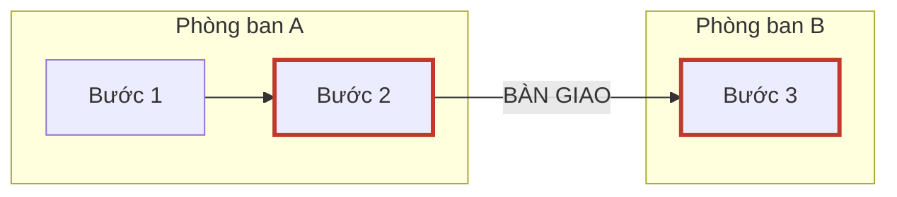

# Report Template — báo cáo ngành 5 lớp

Ghi ra `LIBRARY/<slug>/<slug>-industry-report.md`. Viết theo ngôn ngữ user đang dùng — các nhãn dưới
đây dịch theo, riêng thuật ngữ ngành trong glossary giữ nguyên gốc.

---

```markdown
# Hồ sơ ngành: <Tên ngành — lát cắt cụ thể>

> **Phạm vi:** <lát cắt> · <địa lý> · <phân khúc quy mô>
> **Ngày tra cứu:** <YYYY-MM-DD> · **Số nguồn:** <n> · **Số doanh nghiệp đã lấy mẫu:** <n>
> **Vị thế của tài liệu này:** đủ để hỏi đúng chỗ, không phải để kết luận thay khách hàng. Mọi khẳng
> định ở đây là *chuẩn ngành theo nguồn công khai*; doanh nghiệp cụ thể luôn lệch, và chỗ lệch đó
> chính là nội dung buổi discovery.
> **Hạn dùng:** dữ liệu ngành phân rã theo quý. Sau <YYYY-MM-DD + 3 tháng> nên chạy lại thay vì dùng lại.

## Đọc trong 60 giây

<5 gạch đầu dòng. Mỗi gạch phải là một điều **làm thay đổi cách bạn nói chuyện với khách** — không
phải một sự thật thú vị. Mỗi gạch có [S#].>

---

## Lớp 1 · Kinh tế đơn vị

- **Kiếm tiền trên đơn vị gì:** <…> [S#]
- **Biên lợi nhuận điển hình:** <…> [S#] — cỡ mẫu: <n> doanh nghiệp
- **Cơ cấu chi phí lớn nhất:** <…> [S#]
- **Chu kỳ mùa vụ:** <cao điểm khi nào, thấp điểm khi nào> [S#]
- **Cửa sổ triển khai:** <mùa nào khách đủ rảnh để chạy dự án — suy ra từ mùa vụ ở trên> **H**
- **Ý nghĩa với CSM:** <1–2 câu: biên mỏng/dày ảnh hưởng thế nào tới cách lập luận giá trị>

## Lớp 2 · Chuỗi quy trình lõi

| # | Bước | Phòng ban chủ trì | Đầu vào | Đầu ra | Bàn giao cho | Nguồn |
|---|---|---|---|---|---|---|
| 1 | | | | | | [S#] |

**Sơ đồ (điểm bàn giao là nơi pain hay nằm):**



**Các điểm bàn giao đáng chú ý:**
1. `<bước X> → <bước Y>` — mất mát gì, ai chịu trách nhiệm khoảng giữa: <…> [S#] hoặc **H**

**Quy trình trên giấy vs thực tế:** <nêu chỗ lệch nếu tìm được; chính khoảng lệch là pain> [S#]

## Lớp 3 · Vai trò × KPI × Pain

> Lớp quan trọng nhất. Cột *Bằng chứng* bắt buộc là số hoặc trích nguyên văn có [S#] — không được là
> nhận định của người viết.

| Vai trò | Bị đo bằng KPI gì | Ai đánh giá họ | Pain hằng ngày | Bằng chứng |
|---|---|---|---|---|
| <tuyến đầu> | | | | "<trích>" [S#] |
| <trưởng nhóm/ca> | | | | |
| <quản lý cấp trung> | | | | |
| <người ký hợp đồng> | | | | |

**Một ngày của người dùng tuyến đầu:** <3–5 câu kể theo trình tự thời gian. Nếu không viết nổi đoạn
này thì lớp 3 chưa đủ — quay lại nghiên cứu.> [S#]

## Lớp 4 · Từ vựng & hệ thống

**Hệ thống lõi thường gặp:**

| Loại | Tên phổ biến trong ngành | Ghi chú vị thế (tích hợp hay thay thế) | Nguồn |
|---|---|---|---|
| | | | [S#] |

**Glossary (20–30 từ):**

| Thuật ngữ | Nghĩa | Người trong nghề thật sự gọi là | Verify? |
|---|---|---|---|
| | | | ✅ [S#] / **H** |

## Lớp 5 · Ràng buộc cứng

| Loại ràng buộc | Nội dung | Ảnh hưởng tới triển khai | Nguồn |
|---|---|---|---|
| Pháp lý / tuân thủ | | | [S#] |
| Kiểm toán / lưu trữ | | | |
| An toàn / ca kíp | | | |
| Thiết bị người dùng cuối | | | |
| Mức số hoá thực tế | | | |
| Hạ tầng (mạng, thiết bị) | | | |

> **Thứ hay giết POC nhất trong ngành này:** <một câu, rõ ràng>

## Mô-típ pain lặp lại

| Mô-típ | Biểu hiện trong ngành này | Đã thấy ở ngành khác? |
|---|---|---|
| | | <tên ngành trong _index.md / chưa> |

## Điều còn chưa biết

| Khoảng trống | Vì sao quan trọng | Cách rẻ nhất để lấp |
|---|---|---|
| | | <hỏi ai / đọc gì / quan sát cái gì> |

## Phụ lục · Nguồn

| ID | URL | Tài liệu | Loại nguồn | Ngày tra |
|---|---|---|---|---|
| S1 | | | | |

<Nếu có nguồn nội bộ do user cung cấp, để thành bảng riêng bên dưới và ghi rõ là nội bộ.>
```

---

## Quality bar — chạy hết trước khi cho user xem

**Bằng chứng**
- [ ] Mọi số, tên, ngày, tên hệ thống trong thân bài có `[S#]` tồn tại trong phụ lục.
- [ ] Không `S#` nào trong phụ lục bị bỏ không dùng; không `[S#]` nào trong thân bài thiếu ở phụ lục.
- [ ] Không ô nào bị bỏ trắng. Ô thiếu ghi đúng "Chưa tìm được trong nguồn đã tra".
- [ ] Mâu thuẫn giữa nguồn được nêu ra kèm lý do chọn nguồn hiện hành, không im lặng chọn một cái.

**Cỡ mẫu**
- [ ] Mọi khẳng định cấp ngành nêu cỡ mẫu ≥3 doanh nghiệp, hoặc đã hạ cấp thành ví dụ có tên công ty.
- [ ] Header nêu rõ phân khúc quy mô — báo cáo không được đọc như thể áp cho mọi cỡ doanh nghiệp.

**Đủ sâu**
- [ ] **Phép thử "một ngày"** đạt: mục "Một ngày của người dùng tuyến đầu" viết được và cụ thể.
- [ ] Bảng Lớp 3 có ít nhất 3 vai trò, trong đó có ít nhất 1 vai trò tuyến đầu (không phải quản lý).
- [ ] Lớp 2 chỉ ra được ít nhất 2 điểm bàn giao.
- [ ] Lớp 5 có dòng "thứ hay giết POC nhất", không bỏ trống.
- [ ] Glossary ≥15 từ và có cột "người trong nghề thật sự gọi là" được điền, không chỉ định nghĩa sách vở.

**Tính trung thực**
- [ ] Mọi suy luận đánh dấu **H**, không trộn lẫn với sự thật có nguồn.
- [ ] "Điều còn chưa biết" không rỗng. Một báo cáo ngành không có khoảng trống là báo cáo đã bịa.
- [ ] Có ngày tra cứu và hạn dùng.

Cái nào fail → sửa. Riêng phép thử "một ngày" fail → quay lại Bước 2 nghiên cứu thêm, không sửa bằng chữ.
