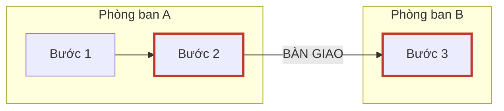
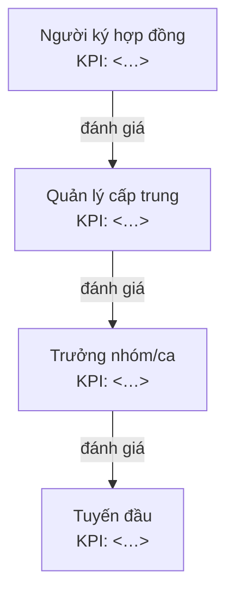
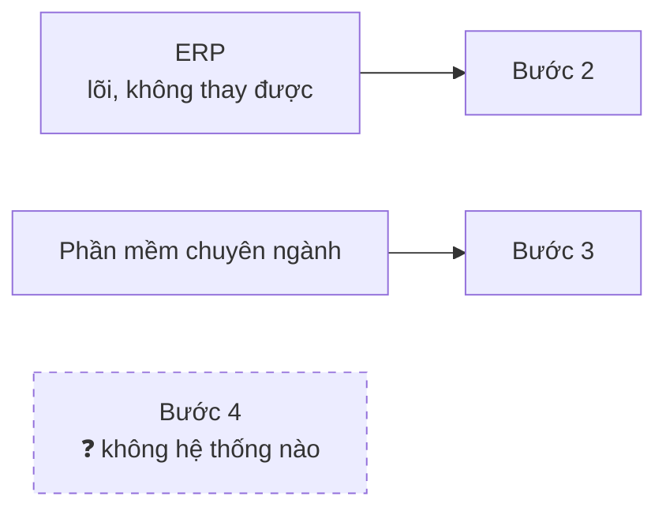

# Report Template: báo cáo ngành 5 lớp

Ghi ra `LIBRARY/<slug>/<slug>-industry-report.md`. Viết theo ngôn ngữ user đang dùng, các nhãn dưới
đây dịch theo, riêng thuật ngữ ngành trong glossary giữ nguyên gốc.

## Luật trích dẫn: một sự thật, một dấu nguồn, một chỗ

`[S#]` đặt ngay trong ô hoặc câu chứa sự thật, không tách thành cột "Nguồn" riêng ở cuối hàng. Một
hàng bảng thường mang nhiều sự thật từ nhiều nguồn khác nhau, cột cuối hàng không diễn tả được điều
đó và bắt người đọc quét hết hàng mới biết dòng nào có nguồn.

Ngoại lệ duy nhất là cột *Bằng chứng* của Lớp 3. Cột đó bắt buộc là số hoặc trích nguyên văn, nó là
lý do lớp đó tồn tại, không được gộp vào đâu cả.

## Luật vẽ sơ đồ

- Sơ đồ không mang thông tin mới. Mọi node và mọi cạnh phải truy được về một dòng trong bảng ngay
  phía trên nó. Vẽ một mũi tên không có trong bảng cũng là bịa.
- Nhánh nào là suy luận thì gắn `H#` ngay trong nhãn node.
- Bảng dưới 3 dòng thì không vẽ, vẽ chỉ tốn chỗ.
- Tối đa khoảng 9 node. Quá thì cắt nhánh phụ, không thu nhỏ chữ.
- Màu luôn đi kèm nhãn chữ. Bản in đen trắng vẫn phải đọc được.

---

```markdown
# Hồ sơ ngành: <Tên ngành, lát cắt cụ thể>

> **Phạm vi:** <lát cắt> · <thị trường> · <phân khúc quy mô>
> **Ngày tra cứu:** <YYYY-MM-DD> · **Số nguồn:** <n> · **Số doanh nghiệp đã lấy mẫu:** <n>
> **Ngôn ngữ tra cứu:** <ngôn ngữ đã dùng để chạy truy vấn, có thể khác ngôn ngữ báo cáo>
> **Vị thế của tài liệu này:** đủ để hỏi đúng chỗ, không phải để kết luận thay khách hàng. Mọi khẳng
> định ở đây là *chuẩn ngành theo nguồn công khai*; doanh nghiệp cụ thể luôn lệch, và chỗ lệch đó
> chính là nội dung buổi discovery.
> **Hạn dùng:** dữ liệu ngành phân rã theo quý. Sau <YYYY-MM-DD + 3 tháng> nên chạy lại thay vì dùng lại.
>
> **Ký hiệu:** `[S#]` sự thật có nguồn · `H#` giả thuyết chưa kiểm chứng · `❓` chưa tìm được trong nguồn đã tra

## Độ phủ nghiên cứu

| Lớp | Trạng thái | Cỡ mẫu DN | Ngôn ngữ nguồn | Chỗ mỏng nhất |
|---|---|---|---|---|
| 1 · Kinh tế đơn vị | | | | |
| 2 · Chuỗi quy trình | | | | |
| 3 · Vai trò × KPI | | | | |
| 4 · Từ vựng & hệ thống | | | | |
| 5 · Ràng buộc cứng | | | | |

🟩 đầy = từ 3 doanh nghiệp trở lên và không ô nào ❓ · 🟨 mỏng = dưới 3 doanh nghiệp hoặc còn ô ❓ ·
🟥 rỗng = không tìm được gì dùng được.

<Thị trường không nói tiếng Anh mà cột "Ngôn ngữ nguồn" toàn tiếng Anh: nói thẳng ở đây rằng lớp đó
mỏng vì lý do ngôn ngữ, đừng để người đọc hiểu nhầm thành ngành minh bạch.>

## Mục lục

- [Đọc trong 60 giây](#đọc-trong-60-giây)
- [Trang mang đi họp](#trang-mang-đi-họp)
- [Lớp 1 · Kinh tế đơn vị](#lớp-1--kinh-tế-đơn-vị)
- [Lớp 2 · Chuỗi quy trình lõi](#lớp-2--chuỗi-quy-trình-lõi)
- [Lớp 3 · Vai trò × KPI × Pain](#lớp-3--vai-trò--kpi--pain)
- [Lớp 4 · Từ vựng & hệ thống](#lớp-4--từ-vựng--hệ-thống)
- [Lớp 5 · Ràng buộc cứng](#lớp-5--ràng-buộc-cứng)
- [Mô-típ pain lặp lại](#mô-típ-pain-lặp-lại)
- [Điều còn chưa biết](#điều-còn-chưa-biết)
- [Nhật ký kiểm chứng](#nhật-ký-kiểm-chứng)
- [Phụ lục · Nguồn](#phụ-lục--nguồn)

---

## Đọc trong 60 giây

<5 gạch đầu dòng. Mỗi gạch phải là một điều làm thay đổi cách bạn nói chuyện với khách, không phải
một sự thật thú vị. Gạch nào nêu số, tên riêng hoặc ngày thì gắn [S#]; gạch nêu nhận định tổng hợp
thì không cần, chi tiết đã có nguồn ở lớp bên dưới.>

## Trang mang đi họp

**Sổ giả thuyết cần khách xác nhận.** Mọi `H#` xuất hiện trong báo cáo đều phải có đúng một dòng ở
đây, và mọi dòng ở đây phải trỏ tới một `H#` có thật.

| ID | Giả thuyết | Lớp | Câu hỏi kiểm chứng | Nếu sai thì đổi gì | Trạng thái |
|---|---|---|---|---|---|
| H1 | | | | | ⬜ chưa hỏi |

Trạng thái: `⬜ chưa hỏi` · `✅ khách xác nhận` · `❌ khách bác bỏ` · `🔄 vẫn mở`

**3 từ phải nói đúng:** <lấy từ glossary. Sai từ vựng là mất uy tín trong 5 phút đầu.>

**1 điều dễ giết POC nhất:** <lấy từ Lớp 5>

---

## Lớp 1 · Kinh tế đơn vị

**Chốt lại:** <một câu, điều duy nhất cần nhớ nếu chỉ đọc một dòng của lớp này>

- **Kiếm tiền trên đơn vị gì:** <…> [S#]
- **Biên lợi nhuận điển hình:** <…> [S#]. Cỡ mẫu: <n> doanh nghiệp
- **Cơ cấu chi phí lớn nhất:** <…> [S#]
- **Ý nghĩa với CSM:** <1–2 câu: biên mỏng hay dày ảnh hưởng thế nào tới cách lập luận giá trị>

**Lịch mùa vụ:**

| T1 | T2 | T3 | T4 | T5 | T6 | T7 | T8 | T9 | T10 | T11 | T12 |
|---|---|---|---|---|---|---|---|---|---|---|---|
| | | | | | | | | | | | |

🔴 cao điểm · 🟢 thấp điểm · ⚪ bình thường · ❓ chưa tìm được trong nguồn đã tra. Nguồn: [S#]

**Cửa sổ triển khai:** <tháng nào khách đủ rảnh để chạy dự án, suy ra từ hàng trên> `H#`

## Lớp 2 · Chuỗi quy trình lõi

**Chốt lại:** <một câu>

Gắn `[S#]` vào ô *Bước*; ô nào lấy từ nguồn khác thì gắn riêng ngay tại ô đó.

| # | Bước | Phòng ban chủ trì | Đầu vào | Đầu ra | Bàn giao cho |
|---|---|---|---|---|---|
| 1 | <…> [S#] | | | | |

**Sơ đồ (điểm bàn giao là nơi pain hay nằm).** Mỗi node là một dòng của bảng trên, mỗi cạnh
`BÀN GIAO` có một dòng tương ứng trong danh sách bên dưới.



**Các điểm bàn giao đáng chú ý:**
1. `<bước X> → <bước Y>`: mất mát gì, ai chịu trách nhiệm khoảng giữa. <…> [S#] hoặc `H#`

**Quy trình trên giấy vs thực tế:** <nêu chỗ lệch nếu tìm được, chính khoảng lệch là pain> [S#]

## Lớp 3 · Vai trò × KPI × Pain

**Chốt lại:** <một câu>

> Lớp quan trọng nhất. Cột *Bằng chứng* bắt buộc là số hoặc trích nguyên văn có [S#], không được là
> nhận định của người viết.

| Vai trò | Bị đo bằng KPI gì | Ai đánh giá họ | Pain hằng ngày | Bằng chứng |
|---|---|---|---|---|
| <tuyến đầu> | | | | "<trích>" [S#] |
| <trưởng nhóm/ca> | | | | |
| <quản lý cấp trung> | | | | |
| <người ký hợp đồng> | | | | |

**Ai đo ai.** Cạnh là quan hệ đánh giá, mỗi node là một dòng của bảng trên.



**Một ngày của người dùng tuyến đầu:** <3–5 câu kể theo trình tự thời gian. Nếu không viết nổi đoạn
này thì lớp 3 chưa đủ, quay lại nghiên cứu.> [S#]

## Lớp 4 · Từ vựng & hệ thống

**Chốt lại:** <một câu, nói rõ vị thế: tích hợp hay thay thế>

**Hệ thống lõi thường gặp:**

| Loại | Tên phổ biến trong ngành | Ghi chú vị thế (tích hợp hay thay thế) |
|---|---|---|
| | <…> [S#] | |

**Bản đồ hệ thống.** Nối hệ thống ở bảng trên vào bước quy trình của Lớp 2. Bước nào không có hệ
thống nào gắn vào là khoảng trống đáng chú ý nhất.



**Glossary (20–30 từ).** Gắn `[S#]` hoặc `H#` ngay sau nghĩa.

| Thuật ngữ | Nghĩa | Người trong nghề thật sự gọi là |
|---|---|---|
| | <…> [S#] | |

## Lớp 5 · Ràng buộc cứng

**Chốt lại:** <một câu>

| Loại ràng buộc | Nội dung | Ảnh hưởng tới triển khai |
|---|---|---|
| Pháp lý / tuân thủ | <…> [S#] | |
| Kiểm toán / lưu trữ | | |
| An toàn / ca kíp | | |
| Thiết bị người dùng cuối | | |
| Mức số hoá thực tế | | |
| Hạ tầng (mạng, thiết bị) | | |

> **Thứ hay giết POC nhất trong ngành này:** <một câu, rõ ràng>

## Mô-típ pain lặp lại

| Mô-típ | Biểu hiện trong ngành này | Đã thấy ở ngành khác? |
|---|---|---|
| | | <tên ngành trong _index.md / chưa> |

## Điều còn chưa biết

| Khoảng trống | Vì sao quan trọng | Cách rẻ nhất để lấp | Trạng thái |
|---|---|---|---|
| | | <hỏi ai / đọc gì / quan sát cái gì> | ⬜ chưa hỏi |

## Nhật ký kiểm chứng

<Cập nhật sau mỗi buổi gặp. Đây là chỗ báo cáo lớn lên bằng dữ liệu thật thay vì cũ đi theo quý.
Ghi vai trò người nói, không ghi tên cá nhân.>

| Ngày | Nguồn (vai trò) | Kiểm chứng cái gì | Kết quả | Đã sửa mục nào |
|---|---|---|---|---|
| | | H<n> / khoảng trống <…> | ✅ / ❌ / 🔄 | |

## Phụ lục · Nguồn

| ID | Nguồn | Loại | Ngày tra |
|---|---|---|---|
| S1 | [<tên tài liệu>](<url>) | tuyển dụng / sơ cấp / pháp lý / diễn đàn / nhà cung cấp | |

<Nguồn chỉ còn tồn tại dưới dạng tóm tắt kết quả tìm kiếm vì fetch thất bại: ghi rõ ở cột Loại.>

<Nếu có nguồn nội bộ do user cung cấp, để thành bảng riêng bên dưới và ghi rõ là nội bộ.>
```

---

## Quality bar, chạy hết trước khi cho user xem

**Bằng chứng**
- [ ] Mọi số, tên, ngày, tên hệ thống trong thân bài có `[S#]` tồn tại trong phụ lục.
- [ ] Không `S#` nào trong phụ lục bị bỏ không dùng; không `[S#]` nào trong thân bài thiếu ở phụ lục.
- [ ] Không ô nào bị bỏ trắng. Ô thiếu ghi đúng "Chưa tìm được trong nguồn đã tra".
- [ ] Mâu thuẫn giữa nguồn được nêu ra kèm lý do chọn nguồn hiện hành, không im lặng chọn một cái.
- [ ] Không bảng nào có cột "Nguồn" riêng ở cuối hàng; `[S#]` nằm trong ô chứa sự thật.

**Cỡ mẫu**
- [ ] Mọi khẳng định cấp ngành nêu cỡ mẫu từ 3 doanh nghiệp trở lên, hoặc đã hạ cấp thành ví dụ có tên
      công ty.
- [ ] Header nêu rõ phân khúc quy mô. Báo cáo không được đọc như thể áp cho mọi cỡ doanh nghiệp.

**Đủ sâu**
- [ ] Phép thử "một ngày" đạt: mục "Một ngày của người dùng tuyến đầu" viết được và cụ thể.
- [ ] Bảng Lớp 3 có ít nhất 3 vai trò, trong đó có ít nhất 1 vai trò tuyến đầu (không phải quản lý).
- [ ] Lớp 2 chỉ ra được ít nhất 2 điểm bàn giao.
- [ ] Lớp 5 có dòng "thứ hay giết POC nhất", không bỏ trống.
- [ ] Glossary từ 15 từ trở lên, có cột "người trong nghề thật sự gọi là" được điền, không chỉ định
      nghĩa sách vở.

**Tính trung thực**
- [ ] Mọi suy luận có ID `H#` duy nhất, không trộn lẫn với sự thật có nguồn, không còn `H` trần nào sót.
- [ ] Mọi `H#` trong thân bài có đúng một dòng trong sổ giả thuyết, và ngược lại.
- [ ] "Điều còn chưa biết" không rỗng. Một báo cáo ngành không có khoảng trống là báo cáo đã bịa.
- [ ] Có ngày tra cứu và hạn dùng.

**Điều hướng & sơ đồ**
- [ ] Bảng độ phủ điền đủ 5 lớp, đúng quy ước 🟩/🟨/🟥.
- [ ] Mỗi lớp có dòng "Chốt lại".
- [ ] "Trang mang đi họp" không rỗng.
- [ ] Mọi node và cạnh trong mọi sơ đồ truy được về một dòng trong bảng ngay trên nó.
- [ ] Mọi sơ đồ đọc được khi in đen trắng, màu không phải tín hiệu duy nhất.

**Ngôn ngữ & thị trường**
- [ ] Header ghi rõ thị trường và ngôn ngữ tra cứu.
- [ ] Thị trường không nói tiếng Anh: có nguồn tiếng bản địa ở Lớp 3, Lớp 4, Lớp 5. Không có thì bảng
      độ phủ phải nói thẳng rằng lớp đó mỏng vì lý do ngôn ngữ.

Cái nào fail thì sửa. Riêng phép thử "một ngày" fail thì quay lại Bước 2 nghiên cứu thêm, không sửa
bằng chữ.
